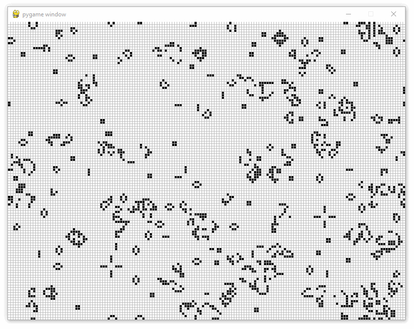

# Игра жизнь 

Игра «Жизнь» (Game of Life) — клеточный автомат, придуманный английским математиком Джоном Конвеем в 1970 году. Это игра, в которой человек создаёт начальное состояние, а потом лишь наблюдает за её развитием.

### Описание
Игра доступна с графикой на PyGame.

### Настройки:
```python
SCREEN_WIDTH = 800  # ширина окна
SCREEN_HEIGHT = 600  # высота окна
FIELD_WIDTH = 160  # ширина поля кратна ширине окна
FIELD_HEIGHT = 120  # высота поля кратна высоте окна
FPS = 10  # количество смен поколений в секунду
```

### Запуск
Игра запускается с полем шириной width, высотой height и заполненное случайными живыми клетками:
```python
game = GraphGame(width=FIELD_WIDTH, height=FIELD_HEIGHT, randomize=True)
```
Игра запускается с полем шириной width, высотой height и фигурой r-pentamino по центру:
```python
game = GraphGame(width=FIELD_WIDTH, height=FIELD_HEIGHT)
game.set_figure('r-pentamino') 
```
Игра запускается с полем шириной width, высотой height и фигурой planner в позиции (5, 20). Фигура бесконечно перемещается по полю:
```python
game = GraphGame(width=FIELD_WIDTH, height=FIELD_HEIGHT)
game.set_figure('planner', row=5, col=20)
```
### Фигуры
- Долгожители:
  - [x] R-пентамино
- Двигающиеся фигуры:
  - [x] Глайдер (планнер)
  - [ ] Космический корабль
- Ружья:
  - [ ] Планерное ружьё Госпера

### Пример
